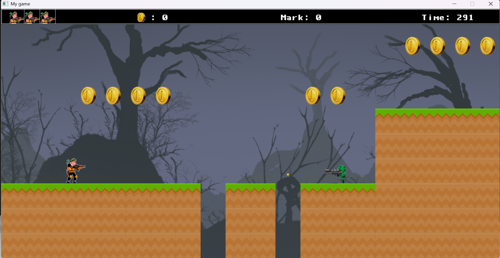

# Strike game - 2D Platformer Project

## Thông tin cá nhân
- **Họ và tên**: Lường Tú Quân  
- **Mã sinh viên**: 24020283

## Giới thiệu chủ đề game
MyGame là một game platformer 2D được xây dựng bằng SDL2 và C++. Người chơi điều khiển một nhân vật chính để vượt qua các chướng ngại vật, thu thập tiền, tiêu diệt kẻ thù, và chạm vào cờ để chiến thắng. Game có các tính năng như menu, tạm dừng, hiển thị điểm số, số tiền, thanh máu, cùng với hiệu ứng đồ họa và âm thanh sống động.

## Ngưỡng điểm mong muốn
Tôi cho rằng project này xứng đáng đạt mức điểm 9-10 theo barem được cung cấp.

## Lý do bảo vệ ngưỡng điểm
Dựa trên barem điểm:

### 4-6: Học và làm game theo nội dung hướng dẫn hàng tuần của giảng viên, nộp bài đúng hạn trên GitHub
- Tôi đã hoàn thành game platformer 2D theo hướng dẫn hàng tuần, bao gồm các tính năng cơ bản như điều khiển nhân vật, vượt chướng ngại, ghi điểm, và kết thúc game.
- Project đã được nộp đúng hạn trên GitHub với đầy đủ mã nguồn và tài nguyên.

### 6.5-7:
1. **Game tự viết với thuật toán đơn giản và không đồ họa**:
   - Game có thuật toán đơn giản: điều khiển nhân vật bằng trọng lực, di chuyển kẻ thù, phát hiện va chạm, và quản lý thời gian chơi (300 giây).
   - Tuy nhiên, game của tôi có đồ họa đầy đủ, nên vượt yêu cầu này.
2. **Lấy cơ số từ code được hướng dẫn và phát triển thêm một chút**:
   - Tôi đã phát triển thêm các tính năng: trạng thái tạm dừng (PAUSED), hiển thị chữ "Paused" với màu trắng, quản lý trạng thái game (MENU, PLAYING, PAUSED, GAME_OVER, WIN), và khởi động lại game khi thua/thắng.

### 7.5-8.5:
1. **Game tự viết có thuật toán nâng cao ngoài chương trình môn học**:
   - Thuật toán va chạm: Kiểm tra va chạm chi tiết giữa nhân vật và bản đồ, đạn và kẻ thù, nhân vật và đạn của kẻ thù.
   - Quản lý trạng thái game với các sự kiện tương ứng (nhấn P để tạm dừng, R để chơi lại, ESC để thoát).
2. **Game tự viết có đồ họa đơn giản**:
   - Game có đồ họa đầy đủ: hình ảnh cho nhân vật, kẻ thù, đạn, bản đồ, hiệu ứng nổ; hiển thị thời gian, điểm số, số tiền, và thanh máu bằng font chữ.
3. **Game phát triển từ code mẫu nhưng có thay đổi đáng kể**:
   - Tôi đã thay đổi đáng kể so với code mẫu: thêm trạng thái PAUSED, hiển thị chữ "Paused" với màu trắng, quản lý nhiều trạng thái game, và thêm hiệu ứng nổ khi tiêu diệt kẻ thù.

### 9-10: Chất lượng ở top 10% của lớp
- **Điểm nổi bật**:
  - **Tính năng tạm dừng**: Nhấn phím P để tạm dừng game, hiển thị chữ "Paused - Press P to Resume" màu trắng, nhấn P lần nữa để tiếp tục.
  - **Hiệu ứng đồ họa và âm thanh**: Nhân vật có animation khi di chuyển/nhảy, hiệu ứng nổ khi tiêu diệt kẻ thù, âm thanh khi bắn, thu thập tiền, và tiêu diệt kẻ thù.
  - **Quản lý trạng thái game**: Hỗ trợ 5 trạng thái (MENU, PLAYING, PAUSED, GAME_OVER, WIN) với giao diện và sự kiện phù hợp.
  - **Tối ưu code**: Sử dụng các lớp như `BaseObject`, `mainObject`, `threatObject` để quản lý đối tượng, giảm lặp code khi xử lý va chạm và hiển thị.

## Các nguồn tham khảo
- **Tutorial SDL2**:
  - [Lazy Foo' Productions - SDL Tutorials](https://lazyfoo.net/tutorials/SDL/): Hướng dẫn cơ bản về SDL2, cách khởi tạo, vẽ hình, xử lý sự kiện.
  - [YouTube - SDL2 Game Development Tutorials](https://www.youtube.com/playlist?list=PLhfAbcv9cehhkG7ZQK0dol2yDzO1YPlt): Video hướng dẫn lập trình game với SDL2.
- **Tài nguyên đồ họa và âm thanh**:
  - Hình ảnh (`background.png`, `player_right.png`, `threat_left.png`, v.v.): Tải từ internet và chỉnh sửa để phù hợp.
  - Âm thanh (`beep_.wav`, `explosion.wav`, `laser.wav`, `backsound.mid`, `action.mid`): Tải từ internet.
  - Font chữ (`dlxfont_.ttf`): Tải từ internet.
- **Tham khảo code mẫu**:
  - Code mẫu từ hướng dẫn của giảng viên (cung cấp trong lớp học), được dùng làm nền tảng và phát triển thêm.

## Mức độ sử dụng AI
- Tôi đã sử dụng AI để hỗ trợ trong quá trình viết code, với các mục đích sau :
  - Gợi ý cải tiến: Thêm tính năng tạm dừng, hiển thị chữ "Paused" với màu trắng, tối ưu quản lý tài nguyên.
  - Tối ưu code: Gợi ý cách tổ chức code thành các lớp, giảm lặp code khi hiển thị text.
- Tuy nhiên, tôi tự học và tự viết phần lớn code, chỉ dùng AI để giải đáp thắc mắc và tối ưu, không sao chép toàn bộ code từ AI.

## Hướng dẫn chạy game
1. Cài đặt SDL2, SDL_image, SDL_ttf, SDL_mixer trên máy tính.
2. Clone repository này về máy: `git clone https://github.com/Quanhyard/Mygame.git`.
3. Mở project trong IDE (như Visual Studio, CodeBlocks).
4. Đảm bảo các file tài nguyên (hình ảnh, âm thanh, font) nằm trong thư mục gốc của project.
5. Biên dịch và chạy file `main.cpp`.

## Cấu trúc project
- `CommonFunc.h`: Hằng số và hàm tiện ích cho game.
- `BaseObject.h/cpp`: Lớp cơ sở cho các đối tượng hiển thị.
- `mainObject.h/cpp`: Lớp quản lý nhân vật chính.
- `threatObject.h/cpp`: Lớp quản lý kẻ thù.
- `bulletObject.h/cpp`: Lớp quản lý đạn.
- `gameMap.h/cpp`: Lớp quản lý bản đồ.
- `textObject.h/cpp`: Lớp quản lý văn bản.
- `explosionObject.h/cpp`: Lớp quản lý hiệu ứng nổ.
- `playPower.h/cpp`: Lớp quản lý thanh máu và biểu tượng tiền.
- `impTimer.h/cpp`: Lớp quản lý thời gian.
- `geoMetric.h/cpp`: Lớp vẽ hình chữ nhật và viền.
- `main.cpp`: File chính chạy game.

---
