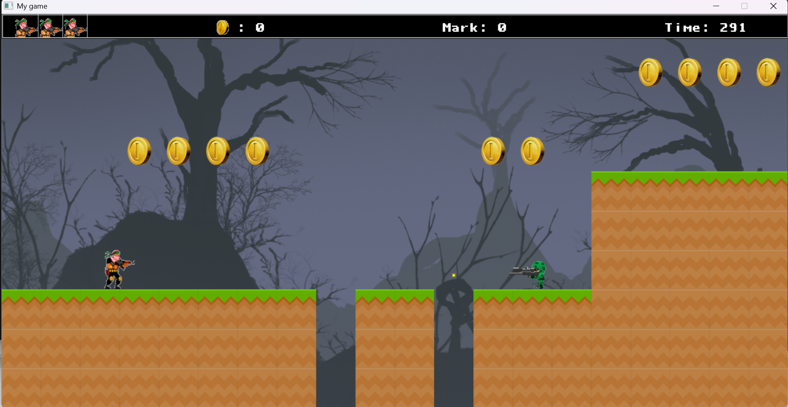

# Strike game - 2D Platformer

A simple 2D platformer game built using C++ and the SDL (Simple DirectMedia Layer) library. The player controls a character to navigate through a tile-based map, collect coins, defeat enemies, and reach the flag to win. The game features a menu, gameplay mechanics, UI elements, sound effects, and background music.

## Table of Contents
- [Features](#features)
- [Gameplay](#gameplay)
- [Installation](#installation)
- [Controls](#controls)
- [Project Structure](#project-structure)
- [Dependencies](#dependencies)
- [Contributing](#contributing)
- [License](#license)
- [Contact](#contact)

## Features
- **Player Mechanics**: Move left/right, jump, and shoot bullets to defeat enemies.
- **Enemies**: Patrol enemies that move back and forth and shoot bullets at the player.
- **Tile-based Map**: A scrollable map with platforms, coins, and a flag as the goal.
- **UI**: Displays time, score, coin count, and health bar.
- **Game States**: Menu, playing, paused, game over, and win states.
- **Sound**: Background music and sound effects for shooting, collecting coins, and explosions.
- **Animations**: Player and enemy animations for walking and jumping.
- **Effects**: Explosion effect when enemies are defeated.

## Gameplay
In this 2D platformer, you control a character to:
- Navigate through a map, avoiding obstacles and collecting coins.
- Defeat enemies by shooting bullets (enemies also shoot back).
- Reach the flag to win the game.
- Avoid falling into pits or getting hit by enemies/bullets (3 lives total).
- Complete the level within 300 seconds, or the game ends.

The game includes a menu to start or exit, a pause feature, and options to restart or quit after winning/losing.

## Installation
### Prerequisites
- **C++ Compiler**: Ensure you have a C++ compiler (e.g., g++).
- **SDL Libraries**: Install the following SDL libraries:
  - SDL2
  - SDL2_image
  - SDL2_ttf
  - SDL2_mixer

### Steps
1. **Clone the Repository**:
   ```bash
   git clone https://github.com/Quanhyard/Mygame.git
   cd Mygame
